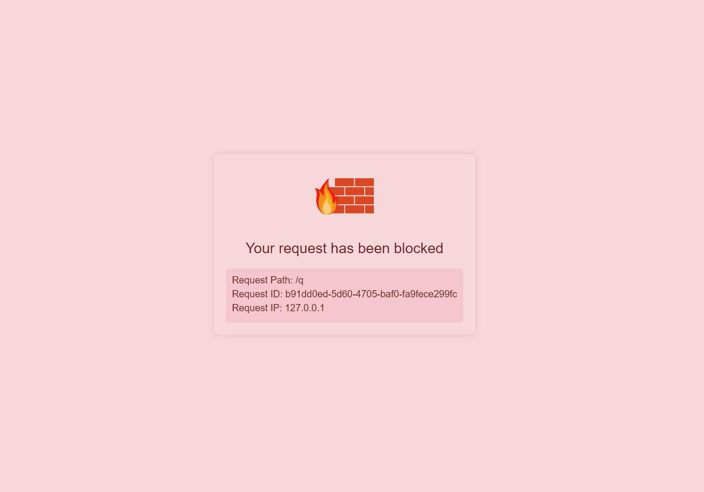

# SWRasp


## Abstract
In today's landscape of cyber attacks, attackers often exploit 0-day or undisclosed 1-day vulnerabilities to breach the internal networks of Fortune 500 companies. They frequently utilize remote control tools like Webshells with encrypted traffic or encrypt data before transmission for enhanced security. Traditional WAF (Web Application Firewall) solutions often struggle to handle decrypted traffic, rendering them ineffective once the attacker's traffic is encrypted.

To address these challenges, we propose a novel runtime defense technology known as SW-RASP.

SW-RASP is a Java application runtime self-protection technique capable of intercepting unknown network attacks at runtime. By leveraging JVMTI-based technology to hook into JDK's underlying logic, SW-RASP can intercept command injection attacks, arbitrary file upload attacks, and detect Webshell connections. Additionally, SW-RASP utilizes Asm syntax tree analysis to identify malicious operations, achieving a 99% interception rate of malicious activities.

Compared to traditional WAF solutions, SW-RASP offers superior protection by not only inspecting traffic but also delving into the underlying logic of applications. Therefore, we recommend replacing traditional WAF with SW-RASP to elevate enterprise security posture.


## Config

```
enableBlockWebShell: true
enableCheckAnyFileRead: true
enableCheckCommandInjection: true
enableCheckFileUpload: true
enableCheckJNDIInjection: true
enableCheckSQLInjection: true
enableCheckXssFilter: true
jndiCheckConfig:
  enableBlockExtranet: true
  enableCheckJNDIInjection: true
  enableWhiteList: false
  whitelist: [127.0.0.1, localhost]
```


## Example

```
java -javaagent:swrasp.jar -jar target/webapp.jar
```

